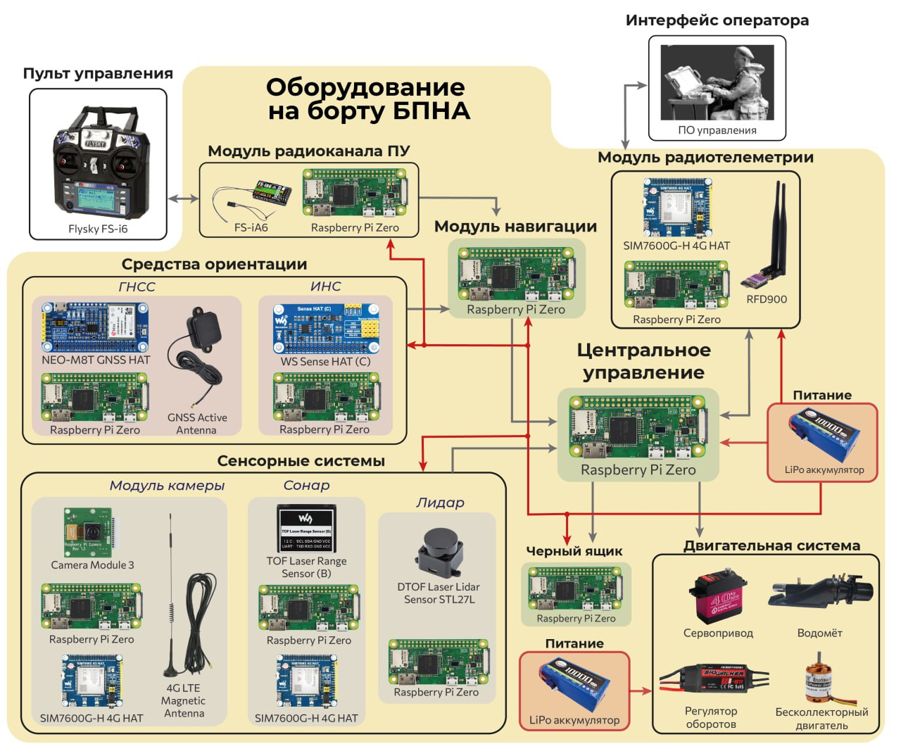

# asvsoft

asvsoft -- command line interface (CLI) for on-board control system software of unmanned boat.

## Examples:

Depth meter data reading:

- with enabled transmitting: `asvsoft depthmeter --port /dev/ttyS0 --baudrate 115200 --dst /dev/ttyAMA5 --dst-baudrate 4800 --loglevel=debug`

- with disabled transmitting: `asvsoft depthmeter --port /dev/ttyS0 --baudrate 115200 --loglevel=debug --transmitting-disabled`

Sense HAT data reading:

`asvsoft sense-hat --dst /dev/ttyAMA5 --loglevel=debug --period=100m`

Controller data reading:

`asvsoft controller --port /dev/ttyAMA0 --baudrate 4800 --loglevel=debug`
